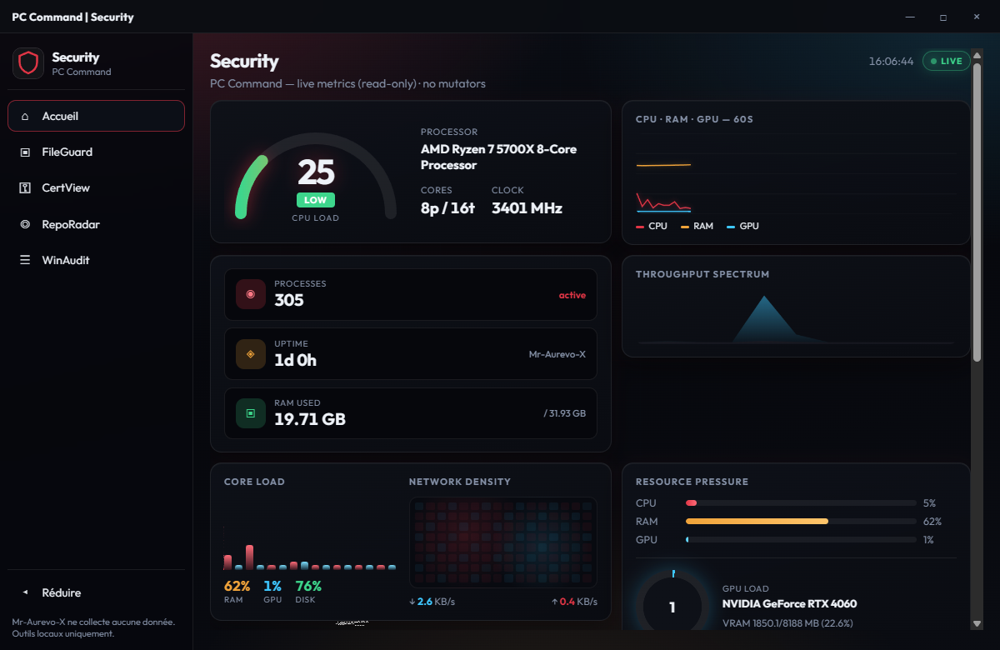
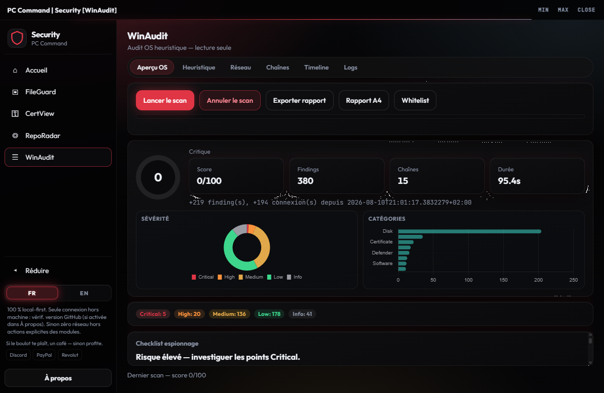

[Français](README.md) · [English](README.en.md)

# PC Command | Security

Hub **Sécurité** — fichiers, certificats, repos, audit Windows. Accueil posture (pare-feu / findings).  
**Gratuit à vie** · **autant local que possible** · **Mr-Aurevo-X**

## Aperçu

| Accueil | WinAudit |
|---------|----------|
|  |  |

## Modules

| Module | Rôle |
|--------|------|
| FileGuard | Garde-fichiers / intégrité |
| CertView | Certificats |
| RepoRadar | Repos sur ton PC · Fetch git seulement si tu cliques |
| **WinAudit** | Audit Windows · score · findings |

## Pourquoi ce hub

- Gratuit à vie — pas d’abonnement, pas de compte
- Autant local que possible — FileGuard, CertView et WinAudit restent sur ta machine
- **Module pas utilisé = pas de sortie réseau**
- Seule sortie volontaire : **RepoRadar → Fetch** vers les remotes git **de tes repos** (si tu cliques)
- Vérif. de mise à jour GitHub **désactivable** dans À propos
- Confirmation avant action système
- Interface FR | EN
- Accueil posture en lecture seule

## Sur ton PC

| Quoi | Où |
|------|-----|
| **App** | Extrais `Launch-Hub-Securite.zip`, lance `Launch-Hub-Securite.exe` |
| Métadonnées | `%LOCALAPPDATA%\PCCommand\` |
| Préférences | `%LOCALAPPDATA%\Mr-Aurevo-X\user-settings.json` (partagé) |

[Télécharger la release](https://github.com/Mr-Aurevo-X/Hub-Securite/releases) · **v2.0.3**

## Lancer

1. Télécharge le zip sur la page Releases ci-dessus  
2. Extrais où tu veux  
3. Lance `Launch-Hub-Securite.exe` (Windows demandera l’admin)

Windows peut afficher un avertissement : les binaires ne sont **pas signés**. C’est **SmartScreen**, pas un antivirus qui dit « virus ».

## Version officielle uniquement

La seule version que je cautionne :

**https://github.com/Mr-Aurevo-X/Hub-Securite**

Un fork ou une copie modifiée ailleurs **n’est pas** ma version — je n’en suis pas responsable.  
Logiciel **tel quel**, sans garantie — détails dans `LICENSE` et `PRIVACY.md`.

## Soutien (optionnel)

Si le boulot te plaît, un café — sinon profite.

---

Rêvée par **Mr-Aurevo-X**. Cursor a réalisé le rêve.
